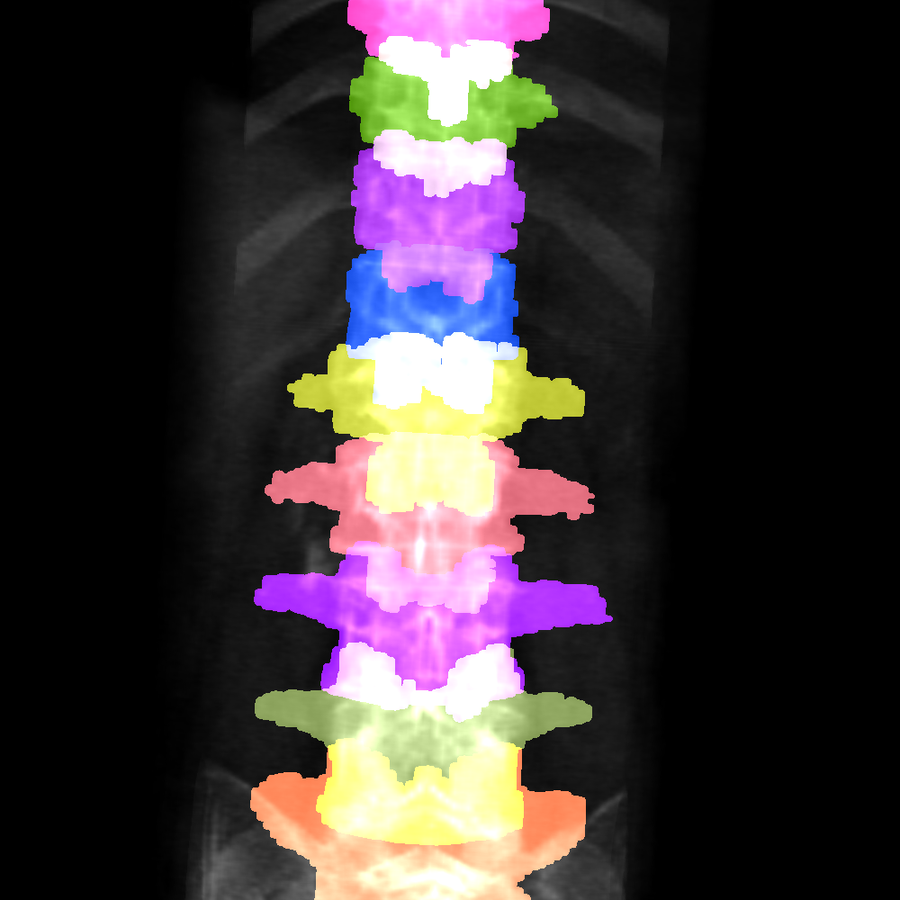
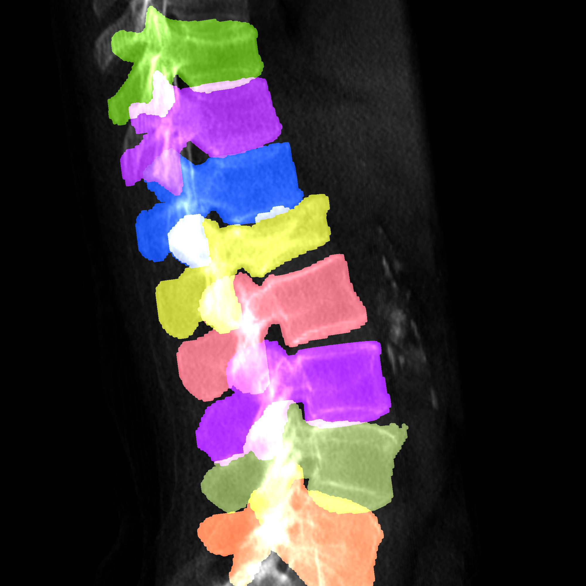

# Deep Learning Spine DRR Toolkit

# 1、Introduction
This repository mainly uses ITK to generate DRR, as well as the corresponding keypoints, detection boxes, and segmentation mask annotations. The generated dataset can be used for pre-trained model training to improve the robustness of deep learning.

# 2、Using
## 2.1.Preliminary preparation
### 2.1.1.ITK tool installation
[Official zip download address](https://docs.itk.org/en/latest/download.html)
* windows：You can skip this step without installing ITK.
* linux：Need to compile and install ITK tool, for specific installation can refer to [itkSoftwareGuide.](https://itk.org/ItkSoftwareGuide.pdf)

## 2.2.Dataset prepare
### 2.2.1.Download
Spine Dataset
* [verse2019 and verse2020](https://github.com/anjany/verse)

* [CTSpine1K](https://github.com/MIRACLE-Center/CTSpine1K)
### 2.2.2.Reoriented
This code uses 3D projection to 2D for annotation, and requires the original CT, as well as the segmented mask. The all CT and mask will be asked to reoriented same direction and same origin.run the following command:
~~~bash
python nii_tools/reoriented_images.py
~~~
### 2.2.4.Crop image
Sometimes common data sets need to be cropped to facilitate the generation of the desired DRRs.
~~~bash
python nii_tools/crop_images.py
~~~

### 2.2.5.merge mask
Sometimes you need to merge masks.
~~~bash
python nii_tools/merge_images.py
~~~
### 2.2.6.Dataset format
This code uses 3D projection to 2D for annotation, and requires the original CT, as well as the segmented mask. Put the data in the **data** folder. The placement format is as follows:
~~~bash
├── ct_dataset1
    ├── example1
    │   ├── L1_seg.nii.gz
    │   ├── L1_body_seg.nii.gz
    │   ├── L2_seg.nii.gz
    │   ├── L2_body_seg.nii.gz
    │   ├── L3_seg.nii.gz
    │   ├── L3_body_seg.nii.gz
    │   ├── L4_seg.nii.gz
    │   ├── L4_body_seg.nii.gz
    │   ├── L5_seg.nii.gz
    │   ├── L5_body_seg.nii.gz
    │   ├── T11_seg.nii.gz
    │   ├── T11_body_seg.nii.gz
    │   ├── T12_seg.nii.gz
    │   ├── T12_body_seg.nii.gz
    │   └── example1.nii.gz
    ├── example2
    │   ├── L1_seg.nii.gz
    │   ├── L1_body_seg.nii.gz
    │   ├── L2_seg.nii.gz
    │   ├── L2_body_seg.nii.gz
    │   ├── L3_seg.nii.gz
    │   ├── L3_body_seg.nii.gz
    │   ├── L4_seg.nii.gz
    │   ├── L4_body_seg.nii.gz
    │   ├── L5_seg.nii.gz
    │   ├── L5_body_seg.nii.gz
    │   ├── T11_seg.nii.gz
    │   ├── T11_body_seg.nii.gz
    │   ├── T12_seg.nii.gz
    │   ├── T12_body_seg.nii.gz
    │   └── example2.nii.gz
~~~
**Where example1 is the subfolder of a CT and the segmented mask, the ct name must be the same as the subfolder name.**

### 2.2.7.verse mask format.
In order to better adapt to the verse format, the mask of each vertebra can be unified in a nii file without separating it.
~~~bash
├── ct_dataset1
    ├── example1
    │   ├── example1_seg.nii.gz
    │   ├── example1.json
    │   ├── example1.png
    │   └── example1.nii.gz
    ├── example2
    │   ├── example2_seg.nii.gz
    │   ├── example2.json
    │   ├── example2.png
    │   └── example2.nii.gz
~~~

## 2.3.Detection(Each vertebra is separated in mask format)
### 2.3.1.Dataset generate
Running the command:
~~~python
python main_drr_detection_dataset.py -c config/detection_config.yml
~~~
### 2.3.2.Parameter Configuration Description(detection_config.yml)
The basic parameters are stored in config/detection_config.yml.The parameters are explained as follows:
~~~bash
ct_root_path: data/verse2020  # ct root folder
dataset_path: data/verse2020_detection_dataset # The generated dataset save path
dataset_images_path: data/verse2020_detection_dataset/images # The generated drrs save path
dataset_masks_path: data/verse2020_detection_dataset/masks # The generated masks save path
dataset_json_path: data/verse2020_detection_dataset/detection_data.json # detection dataset coco format json file

projection_parameter:
  sdr: 500 # The distance between the radioactive source and the projection plane is half
  height: 512 # The default image size
  specific_height_list: {"example1": 3000, "example2": 2500} # The size of the CT image can be specified
  delx: 1 # Distance between pixels
  threshold: 0 # Ct projection threshold
  AP_num_samples: 1 # The number of AP DRRs generated by the single Ct
  LA_num_samples: 1 # The number of LA DRRs generated by the single Ct
  AP_rot_range_list: [[75, 105], [165, 195], [165, 195]] # Range of angles for random rotation of AP
  AP_trans_range_list: [[-15, 15], [-15, 15], [-15, 15]] # Range of angles for random rotation of LA
  LA_rot_range_list: [[-15, 15], [75, 105], [-15, 15]]  # Range of random movement of AP
  LA_trans_range_list: [[-15, 15], [-15, 15], [-15, 15]] # Range of random movement of LA
  AP_bbox_label_type: big # In AP, there are two kinds of annotation frame formats, one is large frame, and the other is small frame. The large frame is used to annotate the projection of each vertebra, and the small is used to annotate the projection of each vertebra (body_seg.IIi.gz).
  LA_bbox_label_type: big # The LA is the same as the AP
  min_bbox_percentage_of_height: 0.05 # This parameter indicates the proportion of the image with the smallest value and is used to exclude small boxes at the edges of the image.

vis_parameter:
  is_vis: True
  vis_save_path: data/verse2020_detection_dataset/bbox_vis
  rotation_bbox_vis_save_path: data/verse2020_detection_dataset/rotation_bbox_vis # vis rotate bbox
~~~
### 2.3.3.Code that is accidentally broken can be regenerated
The generated json file will be automatically saved after each CT generation. Due to accidental termination or active interruption, the generation can continue, and it is necessary to continue to generate and re-run the command
~~~bash
python main_drr_detection_dataset.py -c config/detection_config.yml
~~~
**Note:If you want to regenerate a larger dataset after generating it, you need to delete detection_data.json under data/verse2020_detection_dataset manually. Otherwise, the CT that has been projected in the json file will be automatically detected, starting from the CT that has not been projected.**

### 2.3.4.example

    
    

## 2.4.detection(verse mask format)
To be updated!

## 2.5.Segmantation(Each vertebra is separated in mask format)
### 2.5.1.Dataset generate
Running the command:
~~~python
python main_drr_segmentation_dataset.py -c config/segmentation_config.yml
~~~
### 2.5.2.Parameter Configuration Description(segmentation_config.yml)
The basic parameters are stored in config/segmentation_config.yml.The parameters are explained as follows:
~~~bash
data_root_path: data # data root folder
ct_mask_path: data/verse2020 # ct root folder
dataset_save_root_folder_name: verse2020_segmentation_dataset # The generated dataset save path
APorLA_orientation: all # Choose to generate frontal or lateral or both(AP or LA or all)
mask_categories: ["whole"] # Choose to project the vertebral body, pedicle, other, or entire vertebrae(whole or body pedicle other )
nii_preproess: False # Whether the nii file is preprocessed to avoid the imperfect segmentation mask
has_pedicle: True # Whether the dataset has a pedicle or not, you can use this to get the pedicle part by subtracting the vertebral body and other parts of the vertebrae

projection_parameter:
  sdr: 500 # as detection project parameter
  height: 512 # as detection project parameter
  specific_height_list: {"example1": 3000, "example2": 2500, } # as detection project parameter
  delx: 1 # as detection project parameter
  threshold: 0 # as detection project parameter
  AP_num_samples: 1 # as detection project parameter
  LA_num_samples: 1 # as detection project parameter
  AP_rot_range_list : [[90, 90], [170, 190], [180, 180]] # as detection project parameter
  AP_trans_range_list : [[-10, 10], [-10, 10], [-10, 10]] # as detection project parameter
  LA_rot_range_list: [[90, 90], [170, 190], [90, 90]] # as detection project parameter
  LA_trans_range_list: [[-10, 10], [-10, 10], [-10, 10]] # as detection project parameter

cut_parameter:
  cut_mode: mask_center # Select crop by detection box or crop by mask(mask_center or detection_bbox_center)
  run_object_detection: False # Whether to run object detection, if yes, it can be cut according to the object detection result prediction box, otherwise it can be cut according to the projection mask
  detection_result_json_path: data/verse2020_segmentation_dataset/all/detection_result/bbox.json # The result of object detection
  AP_expand_coefficient: 1.5 # It is necessary to enlarge the box of the AP images prediction by a certain factor of cutting
  LA_expand_coefficient: 1.3 # It is necessary to enlarge the box of the LA images prediction by a certain factor of cutting
  Minimum_width_relative_to_the_image: 0.15 # This parameter indicates the proportion of the image with the smallest value and is used to exclude small boxes at the edges of the image.
  Minimum_height_relative_to_the_image: 0.15 # This parameter indicates the proportion of the image with the smallest value and is used to exclude small boxes at the edges of the image.

vis_parameter:
  is_vis: True # Whether or not to visualize labels
~~~
### 2.5.3.Code that is accidentally broken can be regenerated
The generated json file will be automatically saved after each CT generation. Due to accidental termination or active interruption, the generation can continue, and it is necessary to continue to generate and re-run the command
~~~bash
python main_drr_segmentation_dataset.py -c config/segmentation_config.yml
~~~
**Note: If you want to regenerate a larger dataset after generating it, you need to delete all json files under data/verse2020_segmentation_dataset manually. Otherwise, the CT that has been projected in the json file will be automatically detected, and the CT that has not been projected will be started from the CT that has not been projected.**

### 2.5.4.example

    
    

## 2.6.Segmantation(verse mask format)
to be updated!

## 2.7.Visualize 3d mask and point in 2d image.
### 2.7.1.run command
~~~bash
python visual_tools/vis_3d_point_and_mask.py
~~~
### 2.7.2.3D points and mask project in 2D image.

## 2.8.3D visualization
To be updated

