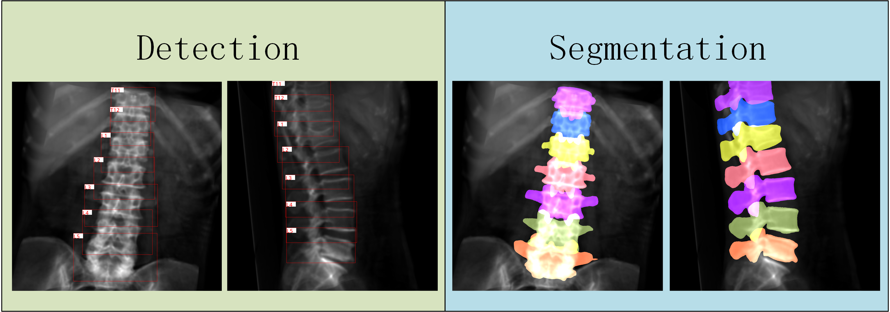
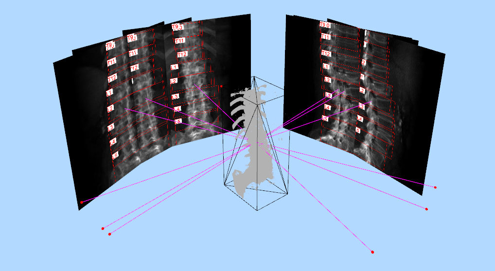
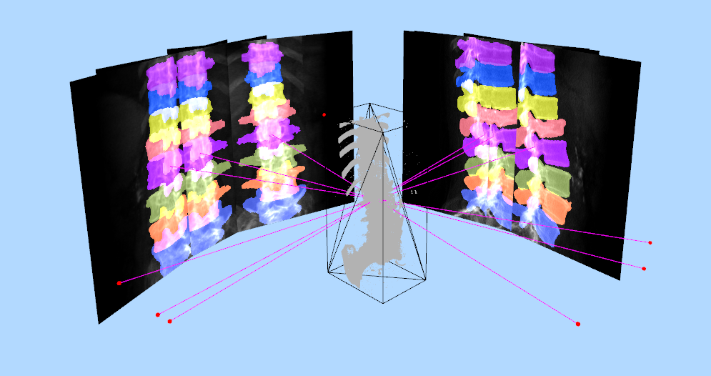
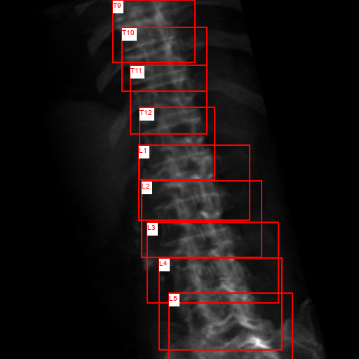
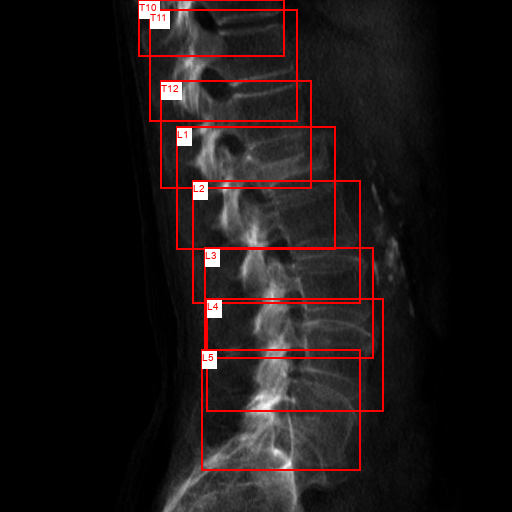
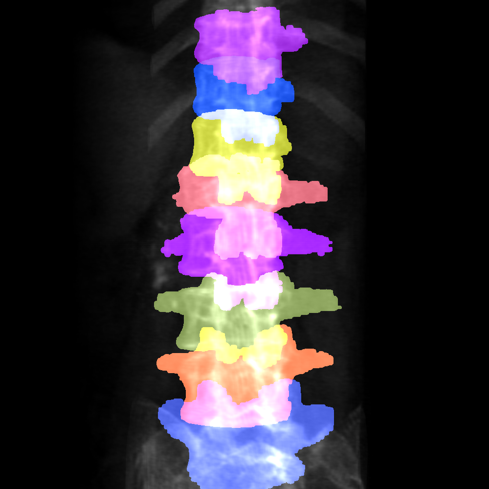
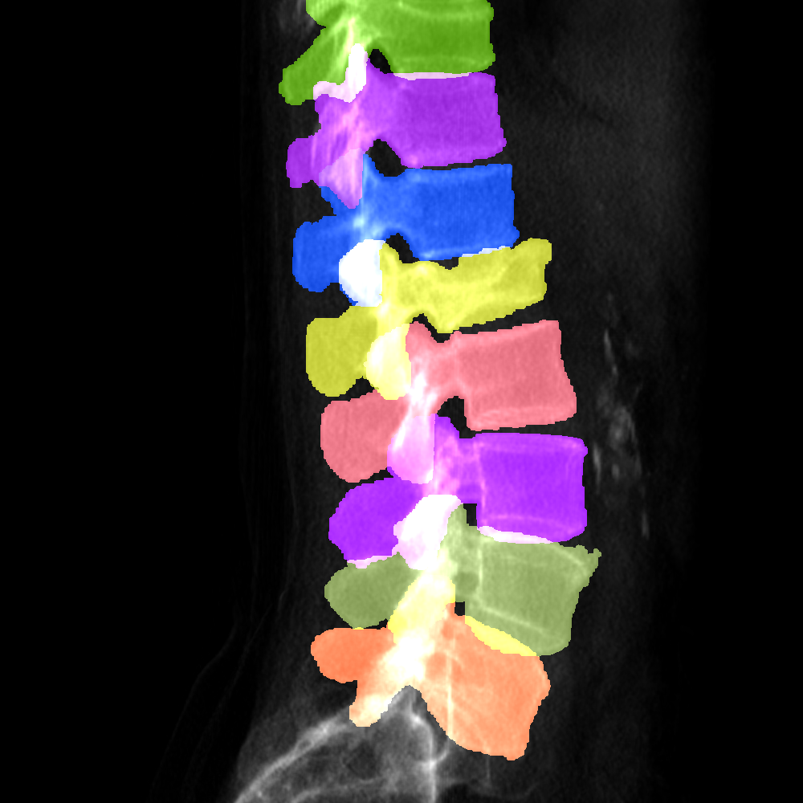
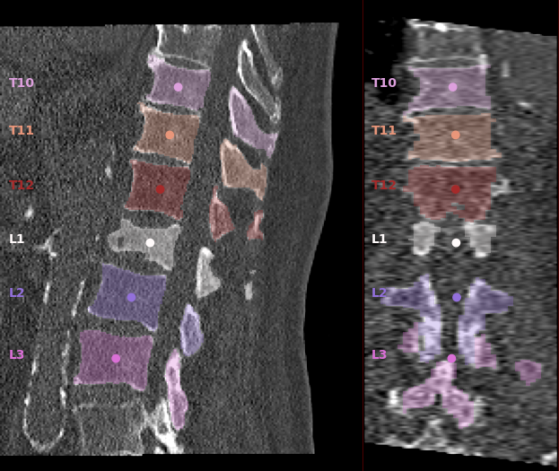
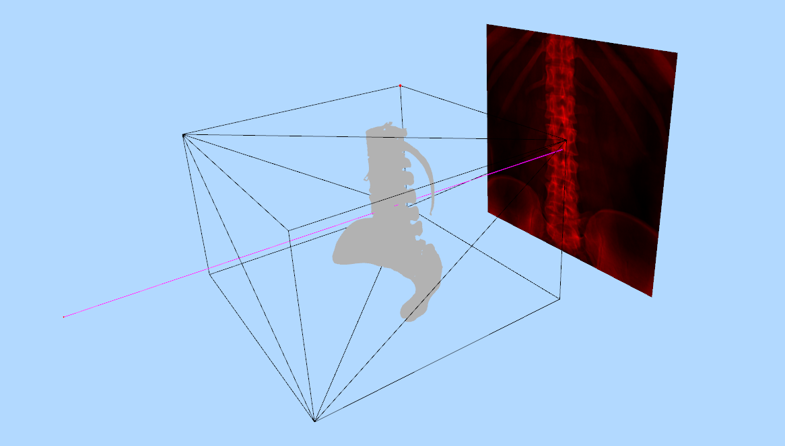
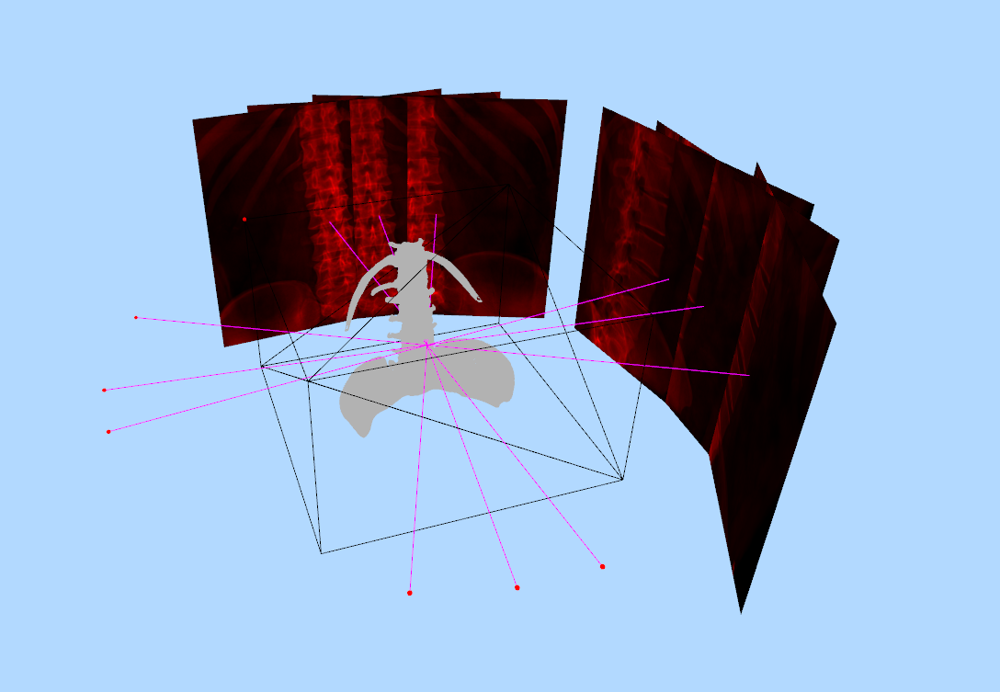

<!--
 * @Description: 
 * @version: 
 * @Author: ThreeStones1029 2320218115@qq.com
 * @Date: 2024-03-26 12:44:24
 * @LastEditors: ShuaiLei
 * @LastEditTime: 2024-07-13 13:01:13
-->
<h2 align="center">Deep Learning Spine DRR Toolkit</h2>
<p align="center">
    <a href="https://github.com/ThreeStones1029/drr_utils/blob/main/LICENSE">
        
    </a>
</p>



open3d vis
<div style="display: flex;">
    
    
</div>

# Introduction
This repository mainly uses ITK to generate DRR, as well as the corresponding keypoints, detection boxes, and segmentation mask annotations. The generated dataset can be used for pre-trained model training to improve the robustness of deep learning.

## TODO
<details>
<summary> see details </summary>

- [x] Detection(verse mask format)
- [x] Segmantation(verse mask format)
- [x] Keypoints dataset generate
- [x] 3D visualization(complete!)

</details>


# Quick start
<details>
<summary>Preliminary preparation</summary>

### ITK tool installation
[Official zip download address](https://docs.itk.org/en/latest/download.html)\
windows：You can skip this step without installing ITK.\
linux：Need to compile and install ITK tool, for specific installation can refer to [itkSoftwareGuide.](https://itk.org/ItkSoftwareGuide.pdf)\
[Here is my install process](document/Ubuntu_ITK_install.md).
</details>


<details>
<summary>Dataset preparation</summary>

[ct dataset format preparation tutorial](document/Dataset_prepare.md)
</details>

<details>
<summary>Detection(Each vertebra is separated in mask format)</summary>

### Dataset generation
```bash
python main_drr_detection_dataset.py -c config/detection_config.yml
```

### Parameter Configuration Description(detection_config.yml)
[Detection datasets to generate specific parameter descriptions](document/Detection_parameter_configuration_description.md)

### Code that is accidentally broken can be regenerated
The generated json file will be automatically saved after each CT generation. Due to accidental termination or active interruption, the generation can continue, and it is necessary to continue to generate and re-run the command
~~~bash
python main_drr_detection_dataset.py -c config/detection_config.yml
~~~
**Note:the CT that has been projected in the json file will be automatically detected, starting from the CT that has not been projected.**

### Regenerate the specified cts.
Sometimes, we main generate single ct wrong, but we don't want to regenerate all cts' drrs. So if you need regenerate the specified cts, just add the ct name in regenerate ct name list. Then run the follow Similar command.Or if you need regenerate all the drrs, just input -r all.
~~~bash
python main_drr_detection_dataset.py -c config/detection_config.yml -r ["du_xiang.nii.gz"] 
python main_drr_detection_dataset.py -c config/detection_config.yml -r all # if -r==all then will regenerate all cts drrs.
~~~

### Example
<div style="display: flex;">
    
    
</div>
</details>


<details>
<summary>Segmantation(Each vertebra is separated in mask format)</summary>

### Dataset generation
Running the command:
~~~python
python main_drr_segmentation_dataset.py -c config/segmentation_config.yml
~~~
### Parameter Configuration Description(segmentation_config.yml)
[Segmentation datasets to generate specific parameter descriptions](document/Segmentation_parameter_configuration_desription.md)

### Code that is accidentally broken can be regenerated
The generated json file will be automatically saved after each CT generation. Due to accidental termination or active interruption, the generation can continue, and it is necessary to continue to generate and re-run the command
~~~bash
python main_drr_segmentation_dataset.py -c config/segmentation_config.yml
~~~
**Note:The CT that has been projected in the json file will be automatically detected, and the CT that has not been projected will be started from the CT that has not been projected.**

### Regenerate the specified cts.
Sometimes, we main generate single ct wrong, but we don't want to regenerate all cts' drrs. So if you need regenerate the specified cts, just add the ct name in regenerate ct name list. Then run the follow Similar command.Or if you need regenerate all the drrs, just input -r all.
~~~bash
python main_drr_segmentation_dataset.py -c config/segmentation_config.yml -r ["du_xiang.nii.gz"] 
python main_drr_segmentation_dataset.py -c config/segmentation_config.yml -r all # if -r==all then will regenerate all cts drrs.
~~~

### Example
<div style="display: flex;">
    
    
</div>
</details>


<details>
<summary>Visualize 3d mask and point in 2d image.</summary>

```bash
python visual_tools/vis_3d_point_and_mask.py
```

### 3D points and mask project in 2D image.

</details>

<details>
<summary>open3d visualize</summary>

```bash
python main_3d_vis.py
```
### Example




</details>


